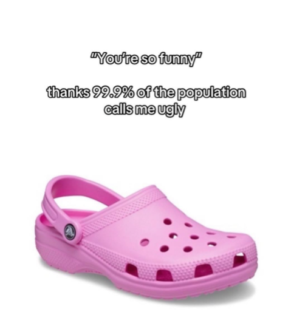
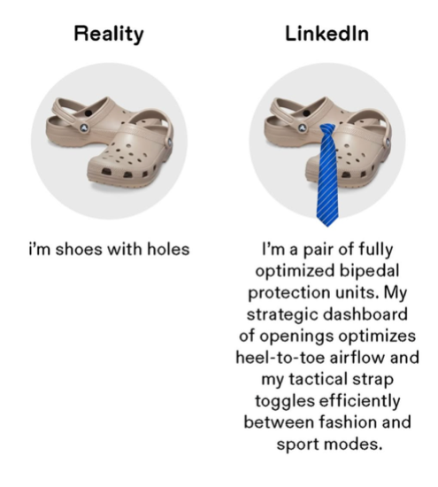
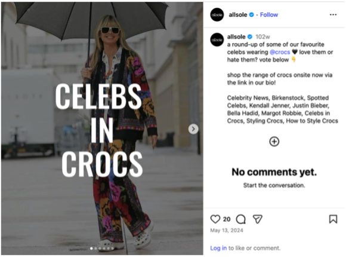
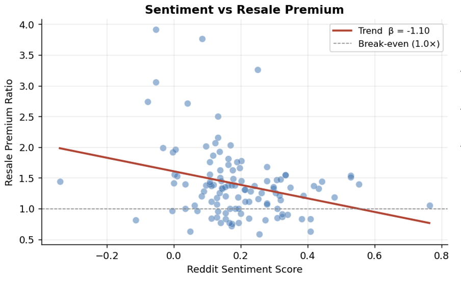
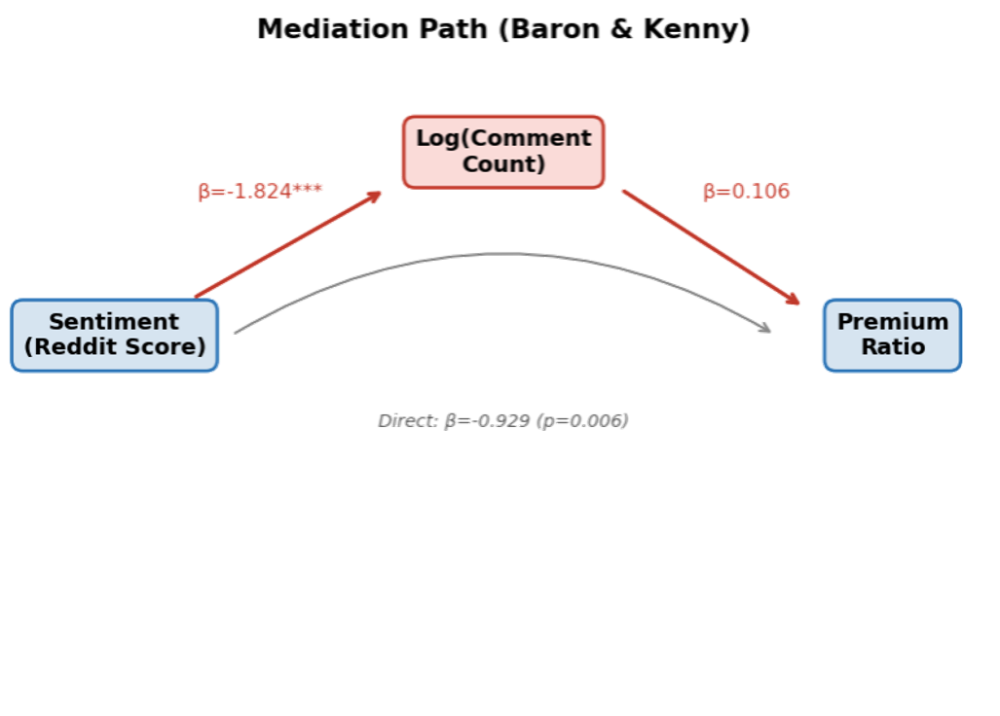
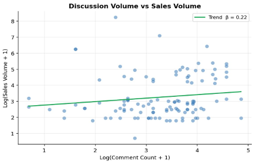
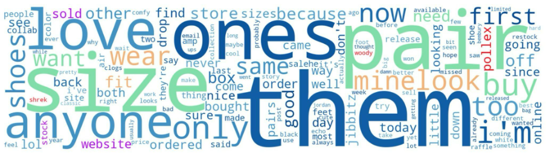

# People Say They Hate Crocs — But They Keep Buying Them, for More Than Retail

**by Xinyan Jiang, Jinyi Li, Linyao Gao, Zhuoru Chen**  
*May 2026 · UIUC MSBA Research Project*

---

Crocs has long been criticized as one of the most controversial products in fashion. After almost every new collaboration release, online discussions — especially on platforms like Reddit — are filled with skepticism, mockery, and confusion about its design.

At the same time, many of these collaborations resell at prices significantly above retail.

This creates a clear tension: if the overall sentiment appears negative, why do these products continue to perform so strongly in the resale market?

 

---

## The Overhype Penalty: Why Popularity Reduces Scarcity

One possible explanation lies in how consumers interpret popularity.

When a product is widely liked, it often signals broad acceptance and accessibility. While this may increase short-term demand, it can reduce the perception of scarcity — an important driver of resale value.

In contrast, products that generate mixed or even negative reactions tend to feel more niche. They attract attention precisely because they challenge expectations.

Our data reflects this pattern: items associated with more positive sentiment generally show lower resale premiums, while those with lower sentiment scores often achieve higher premiums.

Rather than indicating failure, negative reactions may signal that a product is distinctive enough to stand out in a saturated market.

 

---

## The Translation Mechanism: From Controversy to Value

To understand why this happens, it is important to look beyond sentiment and focus on engagement.

Controversial designs tend to generate significantly higher levels of discussion. Consumers are more likely to comment, debate, and share opinions when a product provokes strong reactions.

This increased discussion plays a critical role. It keeps the product visible and reinforces its relevance within the market. In this sense, discussion acts as a bridge between sentiment and value.

This mechanism is not unique to Crocs. Similar patterns can be observed in other fashion cases, such as MSCHF's "Big Red Boots" or Balenciaga's unconventional bag designs. Despite widespread criticism, both generated extensive online attention and strong market demand.

These examples suggest that in the current attention-driven environment, **visibility can outweigh approval**.

---

## Celebrity Amplification and Visibility

Another factor reinforcing this visibility dynamic is celebrity endorsement. Crocs are frequently worn by high-profile figures such as Kendall Jenner, Justin Bieber, and Bella Hadid. These appearances do not necessarily eliminate the product's controversial perception — in many cases, they coexist with it.

Instead, celebrity adoption functions as an **amplifier**. It extends the reach of the product beyond niche online discussions and introduces it into mainstream cultural visibility. When celebrities incorporate Crocs into their everyday or styled outfits, the product gains additional legitimacy while remaining distinctive.

Importantly, this exposure also sustains the cycle of discussion. Celebrity sightings often trigger new waves of commentary, reposts, and debate across platforms, further increasing engagement. In this way, celebrity influence does not replace controversy; it works alongside it, reinforcing visibility and maintaining the product's relevance in the attention economy.

 

---

## Measuring the Buzz

To quantify how people actually feel about Crocs collaborations, we collected Reddit discussions using its public JSON search API. We focused on three communities: **r/crocs**, **r/Sneakers**, and **r/streetwear**, using queries like *"Crocs + brand name."*

We then applied the **VADER sentiment model**, a widely used tool for social media text, which assigns each comment a score from **−1** (most negative) to **+1** (most positive).

To make the data more reliable, we averaged sentiment at the product level and excluded items with fewer than five comments.

This gave us a structured way to connect online opinions with resale performance.

 

---

## Attention as a Driver of Sales

If sentiment alone does not explain performance, what factor does?

Our analysis suggests that **discussion volume** is a more consistent predictor of both resale premiums and sales volume. Products that generate higher levels of engagement tend to perform better overall.

This aligns with how modern digital platforms operate. Algorithms prioritize content that attracts interaction, meaning that highly discussed products are more frequently exposed to potential consumers.

As a result, repeated exposure increases familiarity and keeps the product top-of-mind, which can ultimately influence purchasing behavior.

In this context, consumers may not necessarily buy what they like the most, but rather **what they encounter most frequently**.

  

---

## Public Criticism and Private Interest

Why does negative sentiment raise resale prices? The key factor is **discussion volume**.

Our analysis shows a clear pattern: products with lower sentiment generate more comments, and higher engagement is associated with higher resale premiums. Controversial designs encourage people to react and debate, which increases visibility.

This pattern is not unique to Crocs. Products like MSCHF's "Big Red Boots" or Balenciaga's unconventional designs were widely mocked but quickly sold out. In these cases, controversy amplified attention rather than reducing demand.

This also reflects an **"overhype penalty."** Widely liked products signal accessibility, while controversial ones feel more niche and exclusive — especially in streetwear or celebrity-driven drops.

Celebrity adoption further amplifies this effect. Figures like Kendall Jenner and Justin Bieber wear Crocs, extending their visibility to a broader audience. This exposure sustains discussion and reinforces relevance rather than removing controversy.

  

---

## Attention Sells More Than Approval

If sentiment does not drive performance, what does? Discussion volume appears to be the stronger factor.

Products with higher engagement tend to sell more units.

This aligns with algorithm-driven platforms. The more people comment or repost, the more visibility a product receives. Repeated exposure keeps it top-of-mind and increases the likelihood of purchase.

Consumers do not always buy what they like most — **they often buy what they see most**. Controversial products benefit from this dynamic and can outperform more conventionally appealing designs.

  

---

## People Mock It, But Buy It

Reddit comments reveal an interesting contradiction. Even under controversial products, common words include *buy, need, want,* and *size*.

This suggests that **criticism and purchase intent can coexist**. Users may mock the design publicly while still considering a purchase privately.

This behavior reflects social proof and fear of missing out. When a product receives constant attention, it signals importance. Over time, curiosity can turn into actual purchasing behavior.

  

---

## Final Takeaway

The findings point to a consistent pattern: products that generate controversy tend to attract more discussion, which increases visibility and, ultimately, market value.

For Crocs collaborations, strong performance does not depend on universal approval. Instead, it depends on the ability to remain visible and relevant in a highly competitive attention landscape.

> **In this sense, being distinctive — even polarizing — can be more valuable than being broadly liked.**

---

## About the Authors

This research was conducted by a team of MSBA students at the **University of Illinois Urbana-Champaign (UIUC)**, combining data science, consumer behavior analysis, and market research methodologies.

| Author | Program |
|---|---|
| **Xinyan Jiang** | MS in Business Analytics, UIUC Gies College of Business |
| **Jinyi Li** | MS in Business Analytics, UIUC Gies College of Business |
| **Linyao Gao** | MS in Business Analytics, UIUC Gies College of Business |
| **Zhuoru Chen** | MS in Business Analytics, UIUC Gies College of Business |

*For questions or collaboration inquiries, feel free to reach out via GitHub.*

---

*© 2026 Xinyan Jiang, Jinyi Li, Linyao Gao, Zhuoru Chen — UIUC MSBA Research Group*
